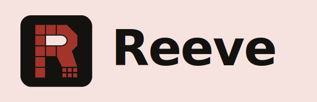

<p align="center">
  
</p>

<p align="center">
  <strong>Audit your AI agents, starting at the endpoint.</strong>
</p>

<p align="center">
  <a href="https://github.com/Reeve-Security/reeve/actions/workflows/ci.yml"></a>
  <a href="https://github.com/Reeve-Security/reeve/releases/latest"></a>
  
  <a href="LICENSE"></a>
</p>

AI assistants inherit the authority of the user running them: local files,
shells, network paths, saved approvals, and MCP servers wired to internal
systems. Reeve reads documented AI-tool config paths, records what is
registered, and emits evidence your existing security and compliance tools
can verify.

Open source, runs locally. Nothing leaves the endpoint.

- **Sees the AI layer.** MCP servers, connectors, extensions, the packages
  behind them, saved "always allow" approvals, and opt-in secrets in chat
  logs, across Claude Desktop / Code / Cowork, Cursor, Codex, and other
  documented surfaces on macOS, Windows, and Linux.
- **Speaks standards.** A CycloneDX 1.5 SBOM and an AIBOM sidecar on every
  scan, with optional Rego policy findings and reports, all in formats your
  pipeline already ingests.
- **Stays local and verifiable.** Reads config files by default, never
  executes agents unless you opt in, signs its releases with Sigstore, and
  can sign scan output the same way.

> Reeve does not decide *safe*. It records evidence: what exists, what is
> granted, what was observed, what a policy flagged. Your patching, MDM,
> GRC, and review process decide what to do.

## Quickstart

Install and run in under a minute. This skips signature verification; to
verify the binary first, see [Verify your download](#verify-your-download).

**Linux / macOS.** Install script, or download the release archive:

```bash
curl --proto '=https' --tlsv1.2 -LsSf \
  https://github.com/Reeve-Security/reeve/releases/latest/download/aibom-cli-installer.sh | sh
```

Prefer not to pipe a script to your shell? Download the `.tar.xz` archive
from the [latest release](https://github.com/Reeve-Security/reeve/releases/latest)
and extract `aibom-cli`.

**Windows.** Download and extract the signed zip (no extra tooling required):

```powershell
$ASSET = "aibom-cli-x86_64-pc-windows-msvc.zip"
Invoke-WebRequest -Uri "https://github.com/Reeve-Security/reeve/releases/latest/download/$ASSET" -OutFile $ASSET
Expand-Archive $ASSET -DestinationPath .\reeve
```

Or download the zip from the
[latest release](https://github.com/Reeve-Security/reeve/releases/latest) in a browser.

Scan an endpoint (reads config files only; does not run agents):

```bash
aibom-cli scan --policy-check --output-dir ./reeve-out --sign-mode fixture
```

By default Reeve scans your home directory and writes to `./out`; use
`--target` and `--output-dir` to choose different paths. The output directory
is created if missing and existing files are not overwritten.

`--sign-mode fixture` keeps this first run offline and instant: it writes a
placeholder signature bundle instead of calling `cosign`. For real Sigstore
signatures, use `--sign-mode real` where a signing identity is configured
(see [Verify your download](#verify-your-download)).

On a shared machine, point `--target` at a parent like `/Users` or
`C:\Users` to scan every immediate child home in one run. Reeve checks known
config paths under the target and one level of child homes, not the whole
disk.

Turn the evidence into a readable report:

```bash
aibom-cli report --aibom ./reeve-out/*.aibom.json --format html --output ./reeve-out/report.html
```

`report` renders one AIBOM sidecar to HTML. The `*.aibom.json` glob selects
the single sidecar a one-endpoint scan writes; if a directory holds several,
pass the exact file path.

To roll up several scan directories into one local fleet summary, use
`aibom-cli fleet-report --evidence-dir <dir>`.

## What Reeve emits

Every scan writes an output triplet:

| File | What |
|---|---|
| `<scan>.cdx.json` | CycloneDX 1.5 SBOM, for the supply-chain scanners you already run |
| `<scan>.aibom.json` | AIBOM sidecar: typed AI-agent evidence (declared vs observed, grants, provenance). Carries Rego policy verdicts when you add `--policy-check`. |
| `<scan>.sigstore.json` or `<scan>.sigstore.fixture.json` | Sigstore bundle for signed output, or a fixture bundle if cosign is unavailable. Use `--sign-mode real` to require real signing. |

On request, never by default:

| Output | How |
|---|---|
| Rego policy findings | `scan --policy-check` (written into the AIBOM sidecar) |
| SARIF (sensitive-data findings) | `scan --sensitive-data-sarif` |
| HTML report | `aibom-cli report` |

## Verify your download

Reeve's release archives and installer are signed with Sigstore (keyless
OIDC, Fulcio + Rekor). A security scanner is itself an attack surface, so
verifying proves the binary you run is the exact artifact Reeve built and
signed in CI, not a tampered copy.

**No account or login is needed to verify.** You only need
[`cosign`](https://docs.sigstore.dev/system_config/installation/) installed.
Verifying is optional for a quick trial and recommended before production or
fleet use.

**Linux / macOS:**

```bash
TAG=v0.3.8
ASSET=aibom-cli-x86_64-unknown-linux-gnu.tar.xz
BASE="https://github.com/Reeve-Security/reeve/releases/download/${TAG}"

curl -LO "${BASE}/${ASSET}"
curl -LO "${BASE}/${ASSET}.bundle"

cosign verify-blob \
  --bundle "${ASSET}.bundle" \
  --certificate-identity-regexp '^https://github.com/Reeve-Security/reeve/.github/workflows/release.yml@refs/tags/v[0-9]+\.[0-9]+\.[0-9]+.*$' \
  --certificate-oidc-issuer "https://token.actions.githubusercontent.com" \
  "${ASSET}"
```

**Windows:**

```powershell
$TAG = "v0.3.8"
$ASSET = "aibom-cli-x86_64-pc-windows-msvc.zip"
$BASE = "https://github.com/Reeve-Security/reeve/releases/download/$TAG"
Invoke-WebRequest -Uri "$BASE/$ASSET" -OutFile $ASSET
Invoke-WebRequest -Uri "$BASE/$ASSET.bundle" -OutFile "$ASSET.bundle"

cosign verify-blob `
  --bundle "${ASSET}.bundle" `
  --certificate-identity-regexp '^https://github.com/Reeve-Security/reeve/.github/workflows/release.yml@refs/tags/v[0-9]+\.[0-9]+\.[0-9]+.*$' `
  --certificate-oidc-issuer "https://token.actions.githubusercontent.com" `
  $ASSET
```

**Verify scan output.** A scan writes a triplet: CycloneDX BOM, AIBOM
sidecar, and signature bundle. For production, scan with `--sign-mode real`
so Reeve fails if cosign is unavailable instead of emitting a fixture bundle.
Run Reeve's structural checks, or use `cosign verify-blob` for full
Fulcio/Rekor proof:

```bash
aibom-cli verify ./reeve-out --verify-crypto
```

## Opt-in execution and profiling

Execution and behavioral profiling are explicit and never default. A
standard scan reads config files only and launches nothing.

```bash
aibom-cli scan --target ~ \
  --introspect-execute --introspect-execute-yes \
  --profile --profile-yes \
  --policy-check --output-dir ./reeve-out
```

`--introspect-execute` runs a discovered stdio MCP server to read its
declared tool list; `--profile` runs the server and records its observed
behavior. Both land as evidence in the AIBOM sidecar.

> [!WARNING]
> **Windows profiling is not sandboxed.** On macOS, `--profile` runs the
> server inside `sandbox-exec`. On Linux, Reeve uses Landlock + seccomp when
> the kernel supports them and records a warning if it must fall back to
> observation without enforcement. On Windows there is no such cage: profiling
> observes the server through ETW but executes it with full user privileges. A
> vulnerable or malicious capability can damage the endpoint. Only profile
> servers you trust on Windows. Kernel containment for Windows (AppContainer)
> is planned for a future release.

## Design choices

Reeve is small on purpose. Every choice below trades cleverness for
something a security team can audit and trust.

**Evidence, not verdicts.** Reeve never labels an agent "safe" or
"dangerous." It reports what a config *declares*, what it *grants*, what
was *observed*, and what a policy *flagged*, each with a file-level
reference.

**CycloneDX 1.5 output, so you don't build new tooling.** Most
organizations already run supply-chain scanners (Grype, Dependency-Track,
Snyk) that speak CycloneDX. Reeve emits a spec-valid CycloneDX 1.5 SBOM so
the AI-agent layer drops into the pipeline you already operate.

**An AIBOM sidecar, because there is no standard yet for AI-agent
evidence.** CycloneDX was not built to express declared-vs-observed
capabilities, Sigstore certificate chains, or per-policy verdicts. We had
three options: cram typed evidence into CycloneDX's string-only property
bag (loses validation), invent a new component type (fails CycloneDX
validation), or carry the typed evidence in a linked sidecar. We chose the
sidecar: a CycloneDX-only consumer still gets a fully valid BOM, and an
AIBOM-aware consumer gets the full typed evidence. If the industry
converges on a canonical AI-agent evidence format, the sidecar data maps
into it, so we stay flexible instead of betting on a standard that does not
exist.

**Local by default. No daemon, no agent, no phone-home.** A security
scanner is itself an attack surface. Reeve runs as one local command, reads
files, and writes output to disk. Nothing leaves the endpoint unless you
move it.

**Rust.** Rust provides memory safety and gives first-class Wasmtime
embedding for the policy engine.

**Policy as Rego, compiled to WebAssembly.** Rego is the policy language of
Open Policy Agent (OPA), a CNCF graduated project widely used for Kubernetes
and cloud policy. Compiling to WASM makes the policy bundle portable,
sandboxed, and signable; the default checks ship as a hash-pinned bundle
embedded at build time.

**Signed releases, signable output.** Sigstore keyless signing (Fulcio +
Rekor) covers release binaries. Scan output can be signed with the same
mechanism; use `--sign-mode real` to require it. The scanner's own
supply-chain integrity is in scope for its security policy, so you can
verify what you run and what it produced.

## Documentation

- [AIBOM schema spec](schema/SPEC.md) · [Policy catalog](policies/README.md)

## License

Apache-2.0. See [LICENSE](LICENSE).
